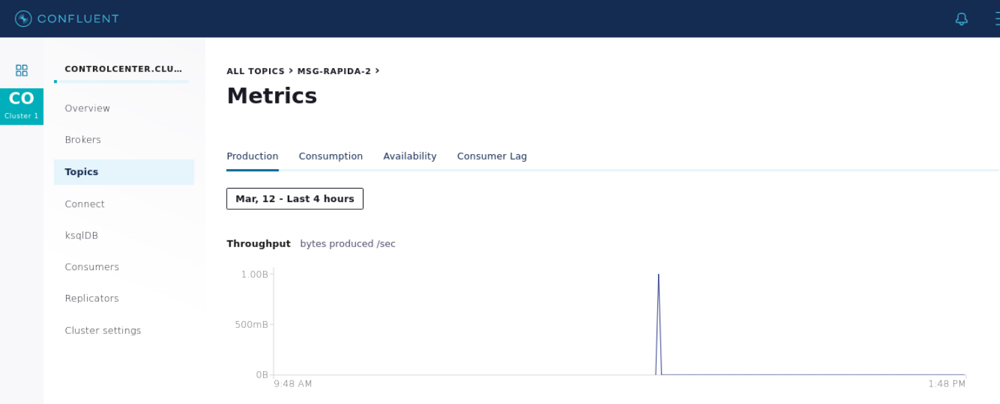

# Kafka - Control Center

- Acessar container:
`docker exec -ti broker bash`
- Acessar interface do Confluent Control Center:
http://localhost:9021/clusters

### 1. Criar um tópico com o nome msg-rapida com 4 partições, 1 replicação e deletar os dados após 5 minutos de uso.
~~~shell
kafka-topics --bootstrap-server localhost:9092 --topic msg-rapida-2 \
             --create --partitions 4 --replication-factor 1 \
             --config cleanup.policy=delete --config retention.ms=300000
#Created topic msg-rapida-2.
~~~

~~~shell
# Ver decrição do tópico:
kafka-topics --bootstrap-server localhost:9092 --topic msg-rapida-2 --describe
#Topic: msg-rapida-2 PartitionCount: 4   ReplicationFactor: 1    Configs: cleanup.policy=delete,retention.ms=300000
#    Topic: msg-rapida-2 Partition: 0    Leader: 1   Replicas: 1 Isr: 1  Offline: 
#    Topic: msg-rapida-2 Partition: 1    Leader: 1   Replicas: 1 Isr: 1  Offline: 
#    Topic: msg-rapida-2 Partition: 2    Leader: 1   Replicas: 1 Isr: 1  Offline: 
#    Topic: msg-rapida-2 Partition: 3    Leader: 1   Replicas: 1 Isr: 1  Offline: 
~~~

### 2. Produzir e consumir 2 mensagens para o tópico msg-rapida.
~~~shell
#Produtor:
kafka-console-producer --broker-list localhost:9092 --topic msg-rapida-2
#Mensagem teste
#Mensagem final
~~~

~~~shell
#Consumidor:
kafka-console-consumer --bootstrap-server localhost:9092 --topic msg-rapida-2
~~~

### 3. Qual o nome do cluster?
`controlcenter.cluster`

### 4. Quantos tópicos existem no cluster?
~~~shell
#Listar os tópicos:
kafka-topics --bootstrap-server localhost:9092 -list
#...
#default_ksql_processing_log
#docker-connect-configs
#docker-connect-offsets
#docker-connect-status
#msg-rapida
~~~

~~~shell
#Contar número de tópicos:
kafka-topics --bootstrap-server localhost:9092 -list | wc -l
#63
~~~

### 5. Quantas partições existem no tópico msg-cli?
~~~shell
kafka-topics --bootstrap-server localhost:9092 --topic msg-cli --describe | head -1
#Topic: msg-cli PartitionCount: 2   ReplicationFactor: 1    Configs: 
~~~

## 6. Todas as réplicas estão sincronizadas no tópico msg-cli?

### 7. Qual a política de limpeza do tópico msg-cli?
`cleanup.policy=delete`

### 8. Alterar a política de limpeza do tópico msg-cli para deletar depois de um ano.
`retention.ms=31536000000`

31536000000 ms = 365 days

### 9. Qual o diretório de armazenamento de logs do cluster?
`/var/lib/kafka/data/`

### 10. Por padrão os dados são mantidos por quantos dias no Kafka?
604800000 ms = 168 horas = 7 dias.

### 11. Visualizar os gráficos de produção e consumo de dados do tópico msg-rapida.

###################