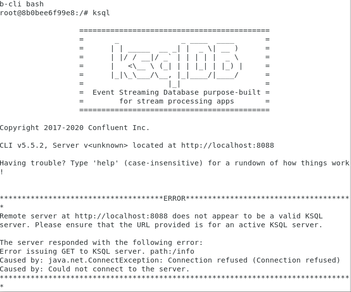
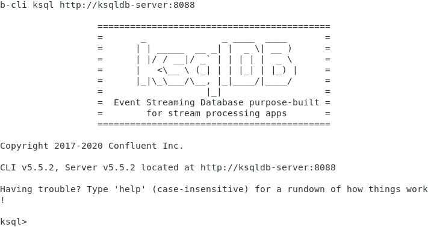

# Kafka - KSQL

- Acessar container:
~~~shell
# Apresenta erro:
docker exec -it ksqldb-cli bash
>ksql
~~~
Ou:
~~~shell
# Apresenta erro:
docker exec -it ksqldb-cli ksql http://localhost:8088
~~~

~~~shell
# Funciona corretamente:
docker exec -it ksqldb-cli ksql http://ksqldb-server:8088
~~~

- Acessar interface:
http://localhost:9021/clusters/

~~~ksql
# Listar tópicos:
ksql> list topics;

 Kafka Topic                 | Partitions | Partition Replicas 
---------------------------------------------------------------
 default_ksql_processing_log | 1          | 1                  
 docker-connect-configs      | 1          | 1                  
 docker-connect-offsets      | 25         | 1                  
 docker-connect-status       | 5          | 1                  
 msg-cli                     | 2          | 1                  
 msg-rapida                  | 4          | 1                  
 msg-rapida-2                | 4          | 1                  
---------------------------------------------------------------
~~~

### 1. Criar o tópico msg-usuario-csv:

~~~shell
docker exec -ti broker bash

root@broker:/# kafka-topics --bootstrap-server localhost:9092 --create --topic msg-usuario-csv
Created topic msg-usuario-csv.
~~~

### 2. Criar um produtor para enviar 3 mensagens contendo id e nome separados por virgula para o tópico msg-usuario-csv:

~~~shell
root@broker:/# kafka-console-producer --broker-list localhost:9092 --topic msg-usuario-csv
>1,Jon
>2,Amancio
>3,Sales
~~~

### 3. Visualizar os dados do tópico msg-usuario-csv:
~~~ksql
ksql> print 'msg-usuario-csv' from beginning limit 10;

Key format: SESSION(AVRO) or [...] or KAFKA_STRING
Value format: KAFKA_STRING
rowtime: 3/12/22 8:25:17 PM UTC, key: <null>, value: 1,Jon
rowtime: 3/12/22 8:25:24 PM UTC, key: <null>, value: 2,Amancio
rowtime: 3/12/22 8:25:28 PM UTC, key: <null>, value: 3,Sales
Topic printing ceased
~~~

~~~shell
root@broker:/# kafka-topics --bootstrap-server localhost:9092 --topic msg-usuario-csv --describe

Topic: msg-usuario-csv	PartitionCount: 1	ReplicationFactor: 1	Configs: 
	Topic: msg-usuario-csv	Partition: 0	Leader: 1	Replicas: 1	Isr: 1	Offline:
~~~

### 4. Criar o Stream usuario_csv para ler os dados do tópico msg-usuario-csv:

~~~ksql
ksql> create stream usuario_csv (id int, nome varchar) with (kafka_topic='msg-usuario-csv', value_format='delimited');

 Message        
----------------
 Stream created 
----------------
~~~

### 5. Visualizar o Stream usuario_csv:
~~~ksql
# Config para visualizar os dados desde o início:
ksql> SET 'auto.offset.reset'='earliest';

Successfully changed local property 'auto.offset.reset' to 'earliest'. Use the UNSET command to revert your change.
~~~

~~~ksql
# Visualizar dados:
ksql> select * from usuario_csv EMIT CHANGES;

+------------------+------------------+------------------+------------------+
|ROWTIME           |ROWKEY            |ID                |NOME              |
+------------------+------------------+------------------+------------------+
|1647116717447     |null              |1                 |Jon               |
|1647116724527     |null              |2                 |Amancio           |
|1647116728683     |null              |3                 |Sales             |
Query terminated
~~~

### 6. Visualizar apenas o campo 'nome' do Stream usuario_csv:

~~~ksql
ksql> select nome from usuario_csv EMIT CHANGES;
+------------------+
|NOME              |
+------------------+
|Jon               |
|Amancio           |
|Sales             |
Query terminated
~~~

###################

### Extras:

#### Inserção de dados:
~~~ksql
ksql> insert into usuario_csv (id, nome) values (4, 'J');

ksql> select * from usuario_csv EMIT CHANGES;
+------------------+------------------+------------------+------------------+
|ROWTIME           |ROWKEY            |ID                |NOME              |
+------------------+------------------+------------------+------------------+
|1647116717447     |null              |1                 |Jon               |
|1647116724527     |null              |2                 |Amancio           |
|1647116728683     |null              |3                 |Sales             |
|1647118533932     |null              |4                 |J                 |
Query terminated
~~~

#### Contagem de linhas:
~~~ksql
ksql> select id, count(*) from usuario_csv group by id EMIT CHANGES;

ksql> CREATE STREAM count_tmp AS SELECT 1 AS unit FROM usuario_csv;

 Message                                
----------------------------------------
 Created query with ID CSAS_COUNT_TMP_0 
----------------------------------------

ksql> select count(unit) from count_tmp group by unit EMIT CHANGES;
+--------------+
|KSQL_COL_0    |
+--------------+
|1             |
|2             |
|3             |
|4             |
~~~
