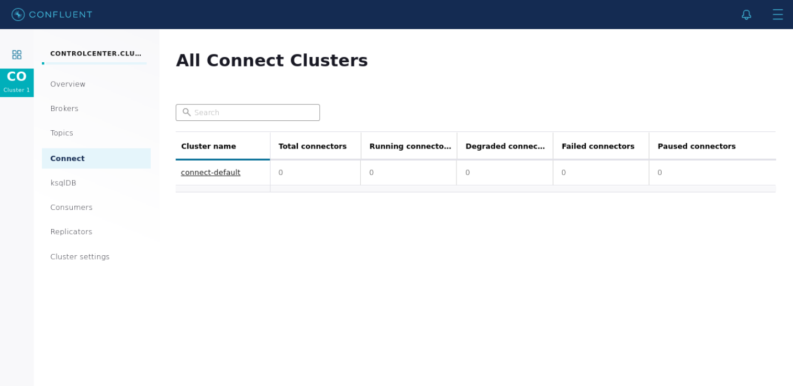
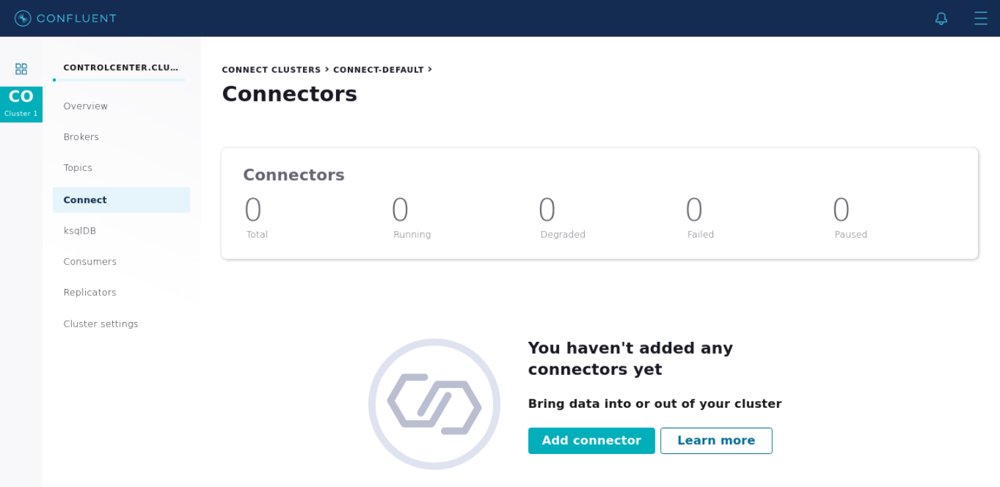
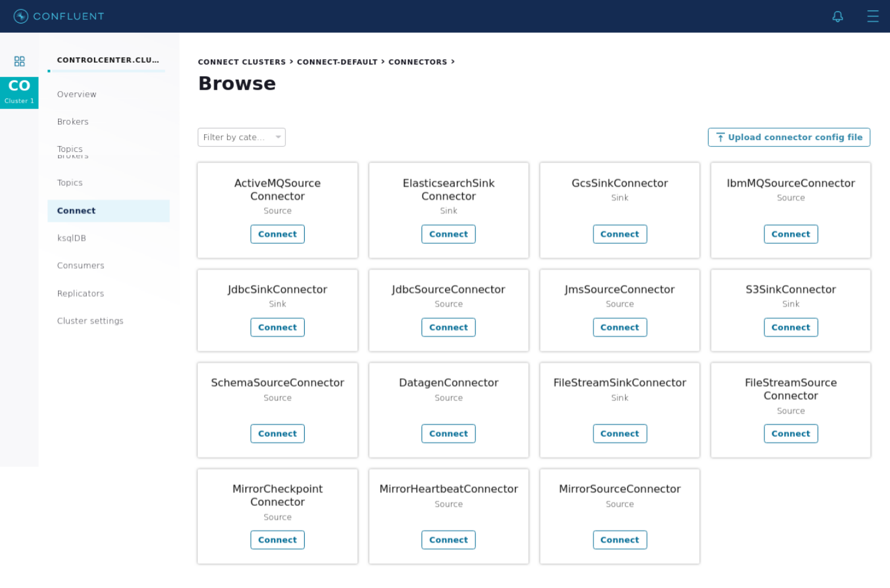
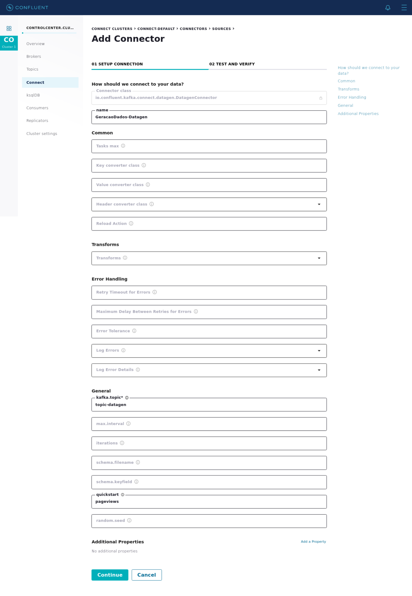
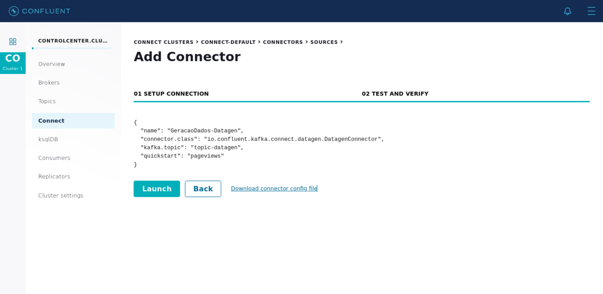
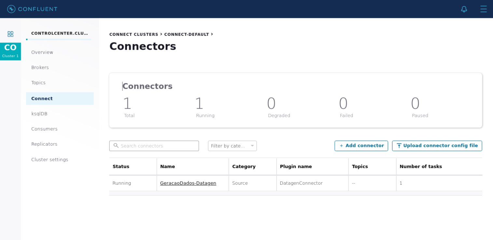
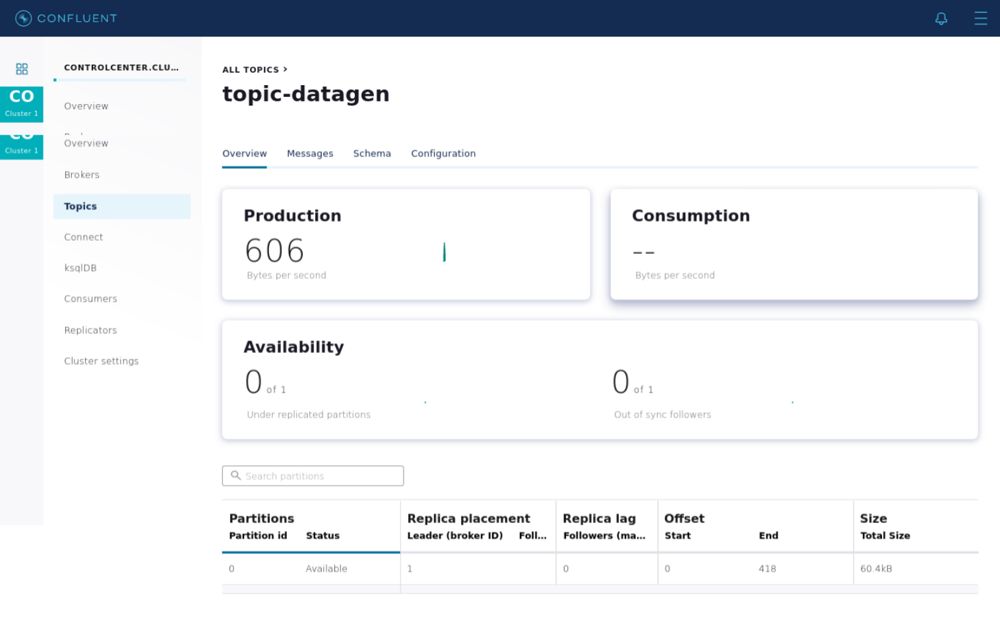
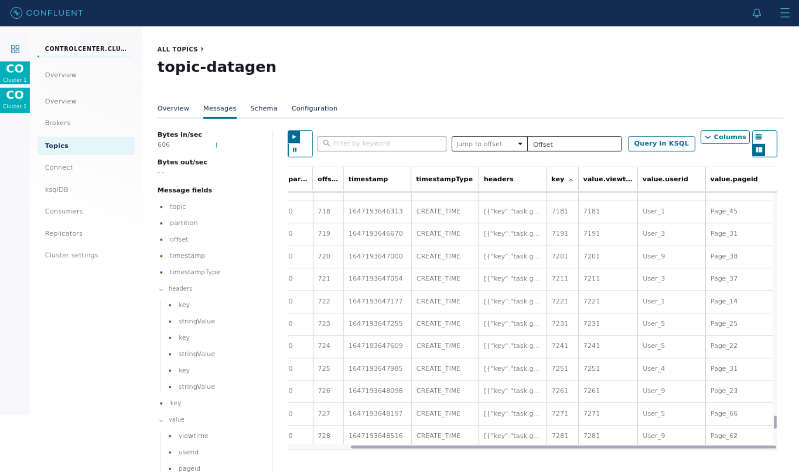
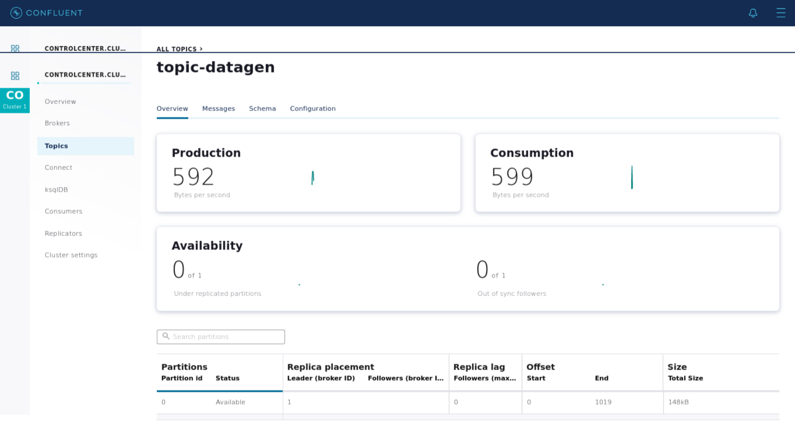
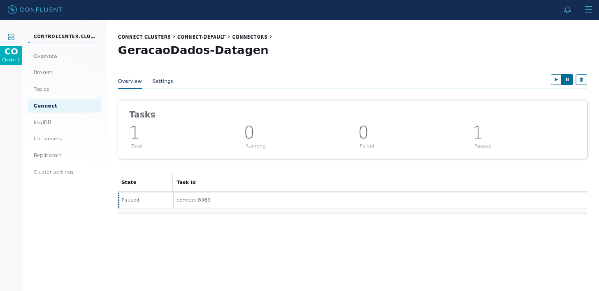

# Kafka - Connect

Acessar interface:
http://localhost:9021/clusters/

### 1. Adicionar o conector do Datagen pela Control Center, com as seguintes configurações:
- Nome do conector: GeracaoDados-Datagen
- Nome do tópico: topic-datagen
- Quickstart: pageviews

> Passo 1: Acesse a seção `Connect` e clique em `connect-default`

> Passo 2: Clique em `Add connector`

> Passo 3: Selecione o conector `DatagenConnector` e clique em `Connect`

> Passo 4: Edite as configurações necessárias e clique em `Continue`

> Passo 5: Clique em `Launch` para ativar o conector

> Passo 6: Na Seção `Connect` pode-se ver o conector ativo

### 2. Visualizar as mensagens no tópico através do Control Center:

> Visualizar tópico:

> Visualizar mensagens:

> Visualizar tópico após algum tempo:

> Pausar conector:

###################